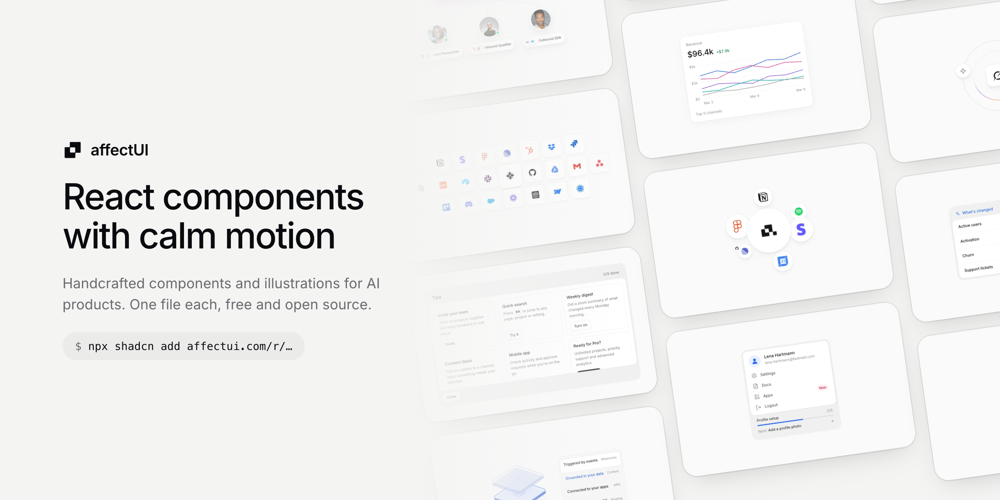
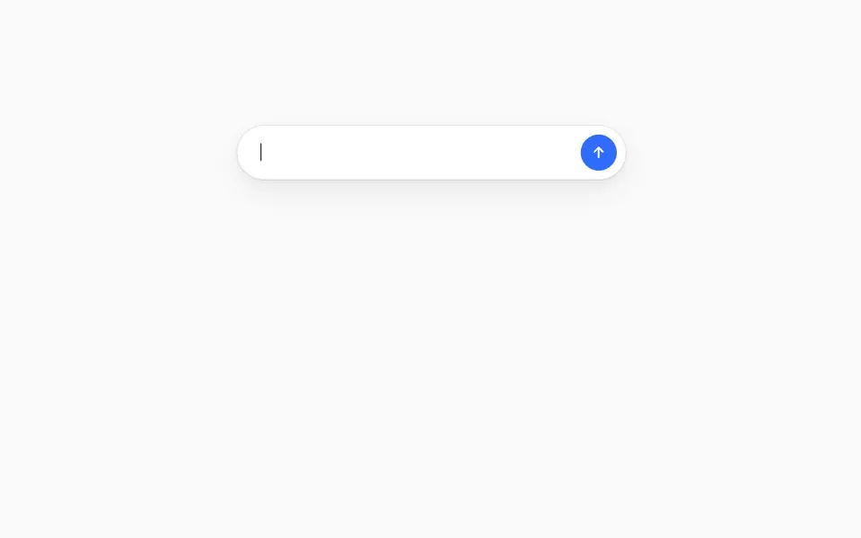
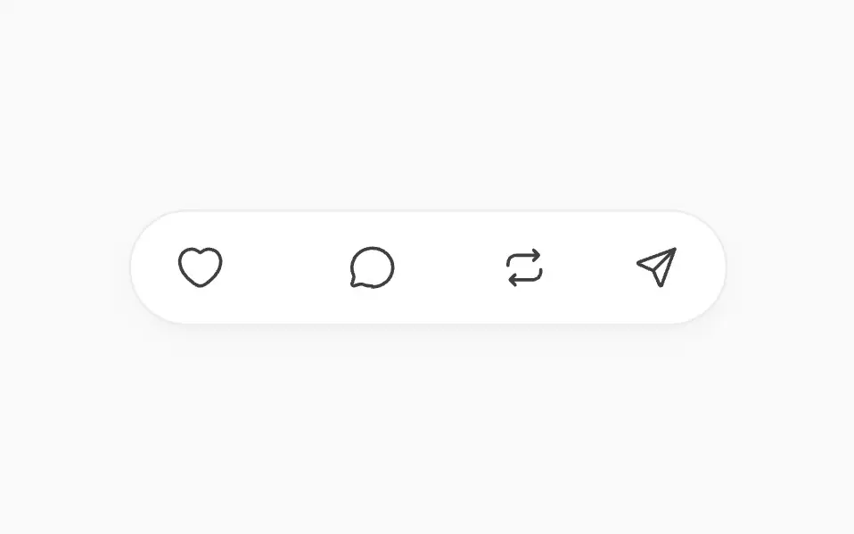
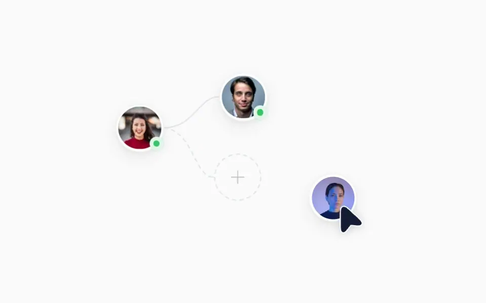
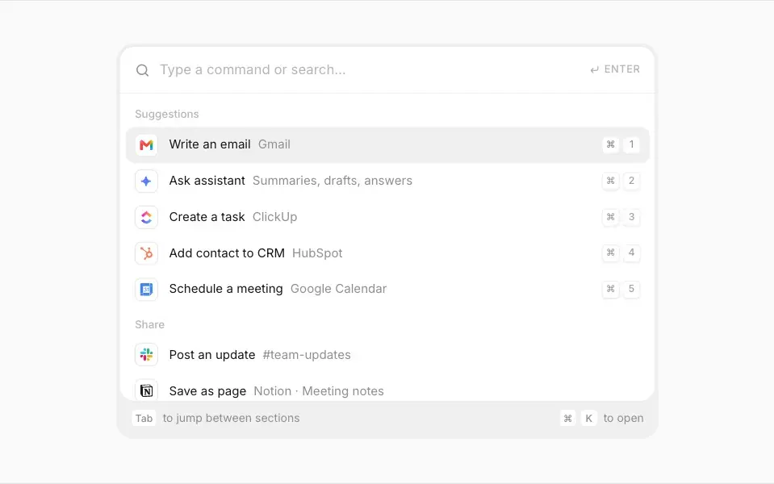
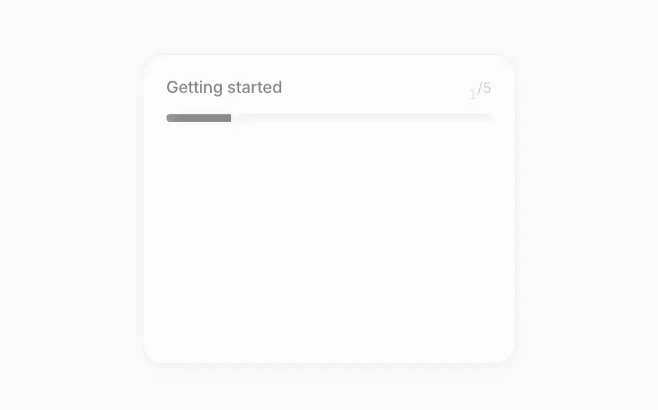
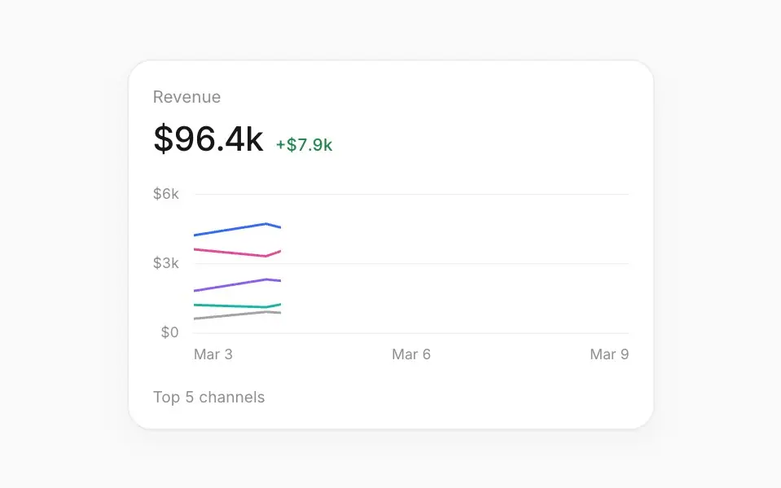
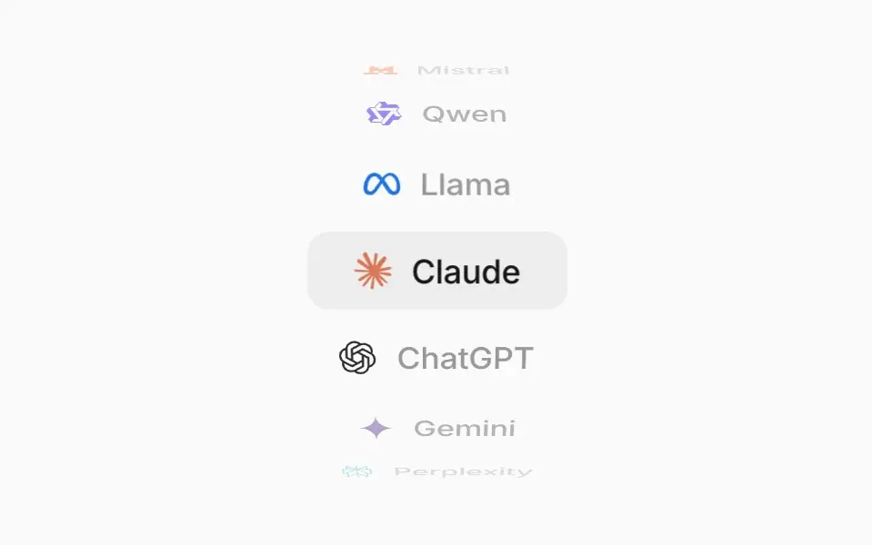

<p align="center">
  <a href="https://www.affectui.com">
    <picture>
      <source media="(prefers-color-scheme: dark)" srcset="./.github/assets/banner-dark.png">
      <source media="(prefers-color-scheme: light)" srcset="./.github/assets/banner-light.png">
      
    </picture>
  </a>
</p>

<p align="center">
  <a href="./LICENSE"></a>
  <a href="https://www.affectui.com/docs"></a>
  
  
  <a href="https://github.com/flohoeller/affectui/stargazers"></a>
</p>

<p align="center">
  <a href="https://www.affectui.com"><b>Website</b></a>
  &nbsp;·&nbsp;
  <a href="https://www.affectui.com/components"><b>Browse components</b></a>
  &nbsp;·&nbsp;
  <a href="https://www.affectui.com/docs"><b>Docs</b></a>
  &nbsp;·&nbsp;
  <a href="#install"><b>Install</b></a>
  &nbsp;·&nbsp;
  <a href="https://www.affectui.com/pricing"><b>Pro</b></a>
</p>

affectUI is a library of handcrafted React components, illustrations and motion effects for AI products and modern SaaS apps. Every item is **one `.tsx` file with its styles inside**: no Tailwind, no CSS setup, no animation library. Install it with the shadcn CLI or copy the file, and it is source you own.

## Showcase

A few favorites, recorded live from [affectui.com](https://www.affectui.com). Items marked <sup>Pro</sup> are part of [affectUI Pro](https://www.affectui.com/pricing) and are not in this repository; everything else installs from here for free.

<table>
<tr>
<td width="50%" valign="top">
<a href="https://www.affectui.com/illustrations/agent-team"><picture>
<source media="(prefers-color-scheme: dark)" srcset="./.github/assets/showcase/agent-team-dark.webp">

</picture></a>
<br><a href="https://www.affectui.com/illustrations/agent-team"><b>Agent Team</b></a><br>
<sub>A prompt types itself and branches out into three agents, each with a role and overlapping tool logos</sub>
</td>
<td width="50%" valign="top">
<a href="https://www.affectui.com/components/reaction-bar"><picture>
<source media="(prefers-color-scheme: dark)" srcset="./.github/assets/showcase/reaction-bar-dark.webp">

</picture></a>
<br><a href="https://www.affectui.com/components/reaction-bar"><b>Reaction Bar</b></a><br>
<sub>Like, comment, repost and share in one pill – icons pop and fill, counts roll in digit by digit</sub>
</td>
</tr>
<tr>
<td width="50%" valign="top">
<a href="https://www.affectui.com/illustrations/team-invite"><picture>
<source media="(prefers-color-scheme: dark)" srcset="./.github/assets/showcase/team-invite-dark.webp">

</picture></a>
<br><a href="https://www.affectui.com/illustrations/team-invite"><b>Team Invite</b></a><br>
<sub>Connected teammates – a cursor drags a new one into the empty slot, the line turns solid and they go online</sub>
</td>
<td width="50%" valign="top">
<a href="https://www.affectui.com/components/command-menu"><picture>
<source media="(prefers-color-scheme: dark)" srcset="./.github/assets/showcase/command-menu-dark.webp">

</picture></a>
<br><a href="https://www.affectui.com/components/command-menu"><b>Command Menu</b></a> <sup><a href="https://www.affectui.com/pricing">Pro</a></sup><br>
<sub>Search and run anything from one field – tool actions with logos and ⌘1–⌘5, everyday commands with icons</sub>
</td>
</tr>
<tr>
<td width="50%" valign="top">
<a href="https://www.affectui.com/components/progress-tracker"><picture>
<source media="(prefers-color-scheme: dark)" srcset="./.github/assets/showcase/progress-tracker-dark.webp">

</picture></a>
<br><a href="https://www.affectui.com/components/progress-tracker"><b>Progress Tracker</b></a><br>
<sub>Onboarding checklist with an animated progress bar, ticks that draw themselves and auto play</sub>
</td>
<td width="50%" valign="top">
<a href="https://www.affectui.com/components/kpi-chart"><picture>
<source media="(prefers-color-scheme: dark)" srcset="./.github/assets/showcase/kpi-chart-dark.webp">

</picture></a>
<br><a href="https://www.affectui.com/components/kpi-chart"><b>KPI Chart</b></a> <sup><a href="https://www.affectui.com/pricing">Pro</a></sup><br>
<sub>Metric card with a multi-line chart and a tooltip that follows the pointer</sub>
</td>
</tr>
<tr>
<td width="50%" valign="top">
<a href="https://www.affectui.com/illustrations/model-wheel"><picture>
<source media="(prefers-color-scheme: dark)" srcset="./.github/assets/showcase/model-wheel-dark.webp">

</picture></a>
<br><a href="https://www.affectui.com/illustrations/model-wheel"><b>Model Wheel</b></a><br>
<sub>AI model names on a turning drum – the rows bend away at the edges and each model lands on a soft gray fill</sub>
</td>
<td width="50%" valign="top">
<a href="https://www.affectui.com/illustrations/logo-cluster"><picture>
<source media="(prefers-color-scheme: dark)" srcset="./.github/assets/showcase/logo-cluster-dark.webp">

</picture></a>
<br><a href="https://www.affectui.com/illustrations/logo-cluster"><b>Logo Cluster</b></a><br>
<sub>Your mark on a white disc in the middle – company logos bounce out of it and settle around it</sub>
</td>
</tr>
</table>

## Contents

- [Why affectUI](#why-affectui)
- [Install](#install)
- [Usage](#usage)
- [Use it with AI tools](#use-it-with-ai-tools)
- [Components](#components)
- [Illustrations](#illustrations)
- [Motion](#motion)
- [affectUI Pro](#affectui-pro)
- [Contributing](#contributing)
- [License](#license)

## Why affectUI

- **One file each.** Every component is a single `.tsx` file with its styles inside. Nothing to configure, no CSS framework required.
- **Motion that feels finished.** Morphs, staggered reveals, rolling numbers and smooth state changes, and all of it respects `prefers-reduced-motion`.
- **Dark mode built in.** Each item switches when an ancestor has the class `dark` or `data-theme="dark"`.
- **Accessible by default.** Real buttons, labels, keyboard support and live regions where they matter.
- **Responsive.** Container queries, so items adapt to the space they get, not just the window.

## Install

### Requirements

- **React 19**, with or without TypeScript
- Any React setup: Next.js, Vite, Remix or plain React
- The `@/*` import alias if you use the shadcn CLI (Next.js and shadcn set it up by default)

### With the shadcn CLI

Every item has its own registry URL. Run the command from its page on [affectui.com](https://www.affectui.com) or from the tables below:

```bash
npx shadcn@latest add https://www.affectui.com/r/reaction-bar.json
```

The file lands in `components/ui`, ready to import.

Prefer short names? Register the namespace once in `components.json`:

```json
{
  "registries": {
    "@affectui": "https://www.affectui.com/r/{name}.json"
  }
}
```

```bash
npx shadcn@latest add @affectui/reaction-bar
```

### Copy and paste

Open the item's folder in this repository (`components/`, `illustrations/` or `motion/`), copy the file into your project and import it. That's all it takes.

## Usage

```tsx
import { ReactionBar } from "@/components/ui/reaction-bar";

export function PostActions({ post }) {
  return (
    <ReactionBar
      reactions={{ like: { count: post.likes, active: post.liked }, comment: { count: post.comments } }}
      onReact={(key, state) => api.react(post.id, key, state.active)}
    />
  );
}
```

Props, keyboard support and accessibility notes for every item are on its page, e.g. [Reaction Bar](https://www.affectui.com/components/reaction-bar).

## Use it with AI tools

Every page on affectui.com has a **Copy prompt** bar: one click copies a ready-made prompt (what the item is, the install command, usage and docs link) and opens it in **Claude, ChatGPT / Codex, Cursor or v0**. The AI adds the component to your project and adapts the content to your app.

## Components

| Name | What it is | Install |
| --- | --- | --- |
| [Button](https://www.affectui.com/components/button) | Primary, secondary, ghost and destructive buttons with icons, sizes and a shimmering loading state | `npx shadcn@latest add https://www.affectui.com/r/button.json` |
| [Change Summary](https://www.affectui.com/components/change-summary) | What moved since last time – one metric per row with a colored trend | `npx shadcn@latest add https://www.affectui.com/r/change-summary.json` |
| [Comment Thread](https://www.affectui.com/components/comment-thread) | One comment with replies – an assistant reports what it did, folds open details and answers @mentions | `npx shadcn@latest add https://www.affectui.com/r/comment-thread.json` |
| [Decision Inbox](https://www.affectui.com/components/decision-inbox) | Open decisions with two quick answers each – answered ones confirm and fold away | `npx shadcn@latest add https://www.affectui.com/r/decision-inbox.json` |
| [Email Draft](https://www.affectui.com/components/email-draft) | Agent-written email for review – switch recipient and tone, edit inline, remove the attachment, send or discard with undo | `npx shadcn@latest add https://www.affectui.com/r/email-draft.json` |
| [Filter Menu](https://www.affectui.com/components/filter-menu) | Grouped filters with removable chips, collapsible checkbox groups, Clear all and full keyboard control | `npx shadcn@latest add https://www.affectui.com/r/filter-menu.json` |
| [Notification Stack](https://www.affectui.com/components/notification-stack) | Notice cards stacked behind each other – dismiss the front one to reveal the next | `npx shadcn@latest add https://www.affectui.com/r/notification-stack.json` |
| [Profile Menu](https://www.affectui.com/components/profile-menu) | Account card with the signed-in user, menu actions and profile setup progress | `npx shadcn@latest add https://www.affectui.com/r/profile-menu.json` |
| [Progress Tracker](https://www.affectui.com/components/progress-tracker) | Onboarding checklist with an animated progress bar, ticks that draw themselves and auto play | `npx shadcn@latest add https://www.affectui.com/r/progress-tracker.json` |
| [Reaction Bar](https://www.affectui.com/components/reaction-bar) | Like, comment, repost and share in one pill – icons pop and fill, counts roll in digit by digit | `npx shadcn@latest add https://www.affectui.com/r/reaction-bar.json` |
| [Smart Recommendation](https://www.affectui.com/components/smart-recommendation) | Suggestion card with a confidence signal, alternatives to switch to and accept with undo | `npx shadcn@latest add https://www.affectui.com/r/smart-recommendation.json` |
| [Tips Panel](https://www.affectui.com/components/tips-panel) | Grid of short tips with one action each – taken tips turn into a done state | `npx shadcn@latest add https://www.affectui.com/r/tips-panel.json` |

## Illustrations

| Name | What it is | Install |
| --- | --- | --- |
| [Agent Team](https://www.affectui.com/illustrations/agent-team) | A prompt types itself and branches out into three agents, each with a role and overlapping tool logos | `npx shadcn@latest add https://www.affectui.com/r/agent-team.json` |
| [DACH Region](https://www.affectui.com/illustrations/region-dach) | DACH map with fading neighbours and a pastel band along the border, switchable to the US, China, India, Brazil or Japan | `npx shadcn@latest add https://www.affectui.com/r/region-dach.json` |
| [Empty Calendar](https://www.affectui.com/illustrations/empty-calendar) | Stack of calendar cards marked empty, fanning out on hover | `npx shadcn@latest add https://www.affectui.com/r/empty-calendar.json` |
| [Enrichment Orbit](https://www.affectui.com/illustrations/enrichment-orbit) | Grok tile inside two rings with comets and data nodes orbiting around it | `npx shadcn@latest add https://www.affectui.com/r/enrichment-orbit.json` |
| [Frost Cloud](https://www.affectui.com/illustrations/frost-cloud) | A frosted white cloud with eyes cut out of it, on a red-orange or blue sky – it floats, turns to look around, blinks, follows the pointer and bounces with a wink when clicked | `npx shadcn@latest add https://www.affectui.com/r/frost-cloud.json` |
| [Ghosted Chat](https://www.affectui.com/illustrations/ghosted-chat) | Unanswered chat messages marked as read, with a thumbs-down reply on hover | `npx shadcn@latest add https://www.affectui.com/r/ghosted-chat.json` |
| [Glow Cloud](https://www.affectui.com/illustrations/glow-cloud) | A glowing cloud with eyes in blue or red-orange – it floats, turns to look around, blinks, follows the pointer and bounces with a wink when clicked | `npx shadcn@latest add https://www.affectui.com/r/glow-cloud.json` |
| [Integration Grid](https://www.affectui.com/illustrations/integration-grid) | Honeycomb-like wall of integration logos around a bright centre tile with your product mark, fading out toward the edges | `npx shadcn@latest add https://www.affectui.com/r/integration-grid.json` |
| [Layer Stack](https://www.affectui.com/illustrations/layer-stack) | Isometric stack of five layers with a list beside it – the chosen entry lifts its layer out in color | `npx shadcn@latest add https://www.affectui.com/r/layer-stack.json` |
| [Lead Sourcing](https://www.affectui.com/illustrations/lead-sourcing) | ChatGPT tile linked to Gmail and Grok, with a shine running along the connection | `npx shadcn@latest add https://www.affectui.com/r/lead-sourcing.json` |
| [Logo Cluster](https://www.affectui.com/illustrations/logo-cluster) | Your mark on a white disc in the middle – company logos bounce out of it and settle around it | `npx shadcn@latest add https://www.affectui.com/r/logo-cluster.json` |
| [Model Wheel](https://www.affectui.com/illustrations/model-wheel) | AI model names on a turning drum – the rows bend away at the edges and each model lands on a soft gray fill | `npx shadcn@latest add https://www.affectui.com/r/model-wheel.json` |
| [Side Folder](https://www.affectui.com/illustrations/side-folder) | Glassy blue folder on its side, documents sliding out to the right as the pocket swings open on hover | `npx shadcn@latest add https://www.affectui.com/r/side-folder.json` |
| [Tab Overload](https://www.affectui.com/illustrations/tab-overload) | Overlapping browser windows where the highlight follows the hovered tab | `npx shadcn@latest add https://www.affectui.com/r/tab-overload.json` |
| [Team Invite](https://www.affectui.com/illustrations/team-invite) | Connected teammates – a cursor drags a new one into the empty slot, the line turns solid and they go online | `npx shadcn@latest add https://www.affectui.com/r/team-invite.json` |

## Motion

| Name | What it is | Install |
| --- | --- | --- |
| [Grid Background](https://www.affectui.com/motion/grid-background) | A fine line grid that drifts slowly behind your content and fades out towards the edges | `npx shadcn@latest add https://www.affectui.com/r/grid-background.json` |
| [Number Ticker](https://www.affectui.com/motion/number-ticker) | Odometer-style numbers – every digit rolls to its new value and counts in from zero when it scrolls into view | `npx shadcn@latest add https://www.affectui.com/r/number-ticker.json` |
| [Shimmer Loader](https://www.affectui.com/motion/shimmer-loader) | Skeleton blocks that share one soft light sweep, plus shimmering text for “Thinking…” states | `npx shadcn@latest add https://www.affectui.com/r/shimmer-loader.json` |
| [Text Reveal](https://www.affectui.com/motion/text-reveal) | Text that arrives word by word or letter by letter – each piece rises out of a soft blur as it scrolls into view | `npx shadcn@latest add https://www.affectui.com/r/text-reveal.json` |

## affectUI Pro

40 more components, screens, blocks and illustrations, including the Command Menu, the Chat Composer, the KPI Chart, the Pricing Plans block and full app screens, are part of [affectUI Pro](https://www.affectui.com/pricing): a one-time purchase with lifetime updates. Their source is not in this repository.

## Contributing

Found a bug or missing a component? [Open an issue](https://github.com/flohoeller/affectui/issues/new/choose). The files here are synced from the affectUI source on every release, so fixes land through issues rather than pull requests. See [CONTRIBUTING.md](./CONTRIBUTING.md).

## License

Everything in this repository is released under the [MIT license](./LICENSE). Use it in personal and commercial projects.
Logos shown in previews belong to their owners and are only sample content.

---

<div align="center">

If affectUI saves you time, a ⭐ helps others find it.

Made by [Flo](https://x.com/flohoeller)

</div>
